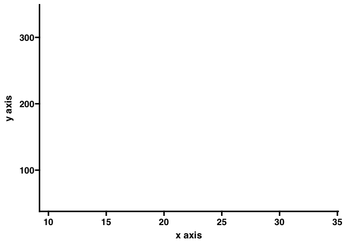
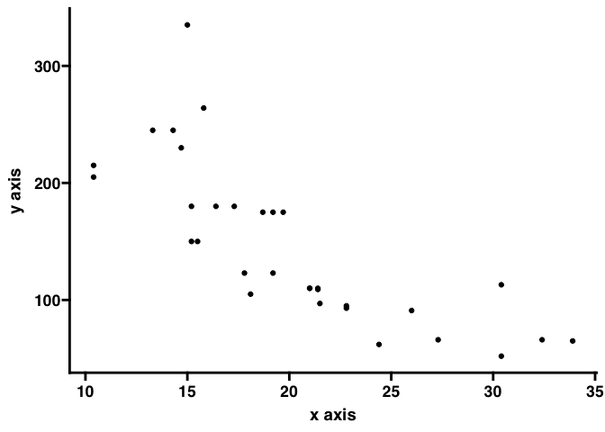
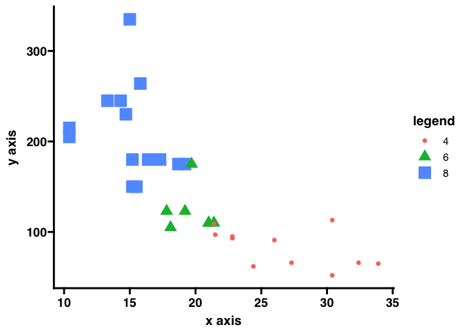
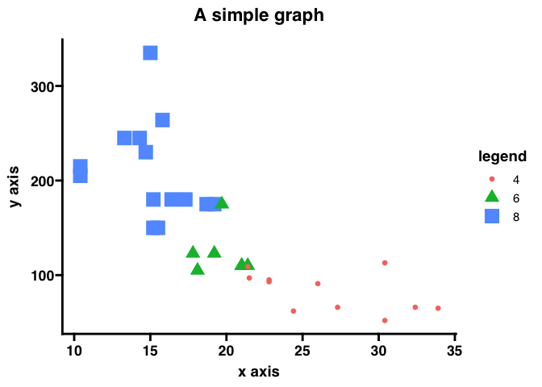
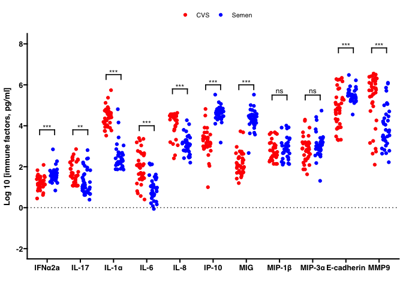
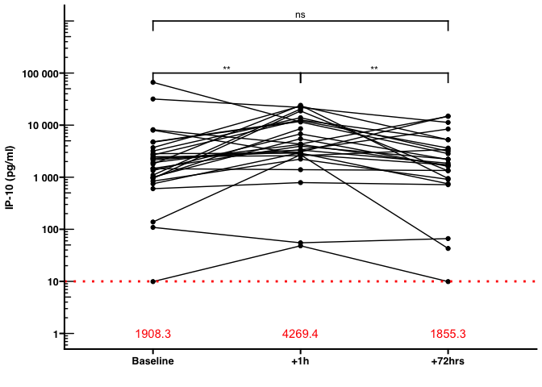
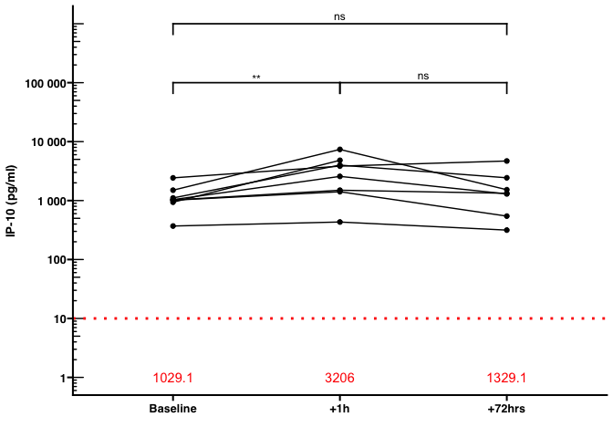
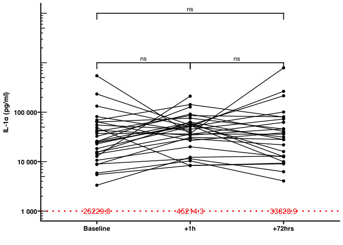
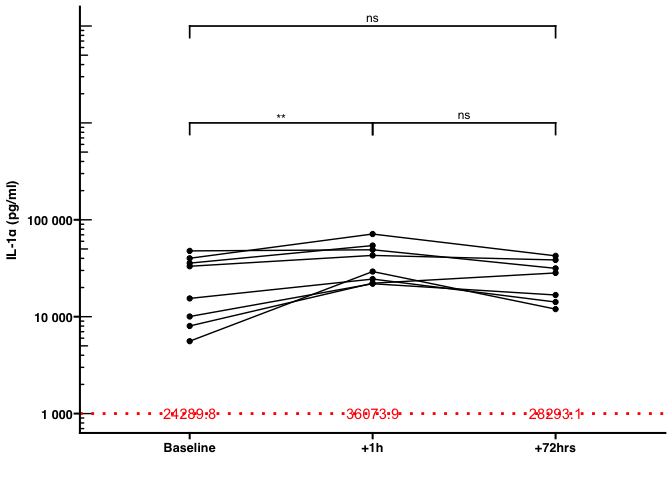
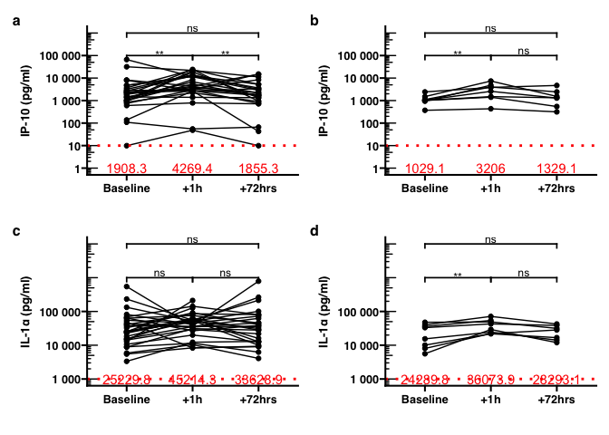

Data visualization using GGPLOT2
================
1/28/23

# About

This is a one-hour workshop to understand the basics of graphs and
visualizing data using `GGPLOT2` in R. This is not by any means a
comprehensive course on R or data visualization, but an attempt to
quickly get researchers started on creating plots using R by
demonstrating an relatively simple example drawn from the literature. On
a technical note regarding themes, the default theme from `ggprism` is
used for the purpose of creating publication-ready graphs.

# Recommended books

1.  [R for data science (2e)](https://r4ds.hadley.nz/)
2.  [Exploratory Data Analysis with
    R](https://bookdown.org/rdpeng/exdata/)
3.  [GGPLOT2
    Cheatsheet](https://posit.co/wp-content/uploads/2022/10/data-visualization-1.pdf)

# Reference & dataset:

Mohammadi, A., Bagherichimeh, S., Choi, Y. et al. Immune parameters of
HIV susceptibility in the female genital tract before and after
penile-vaginal sex. Commun Med 2, 60 (2022).
<https://doi.org/10.1038/s43856-022-00122-7>

# Instructions:

## R & RStudio

Go to the link and follow the steps to install R & RStudio:
<https://posit.co/download/rstudio-desktop/>.

Check which operating system you are using, either windows or macOS.

## Exercise files

1.  Download individual files on this link:
    <https://github.com/myominnoo/workshops/tree/main/2023/01/data-viz-ggplot2>  
2.  Put them in a folder.
3.  Right-click or double-click open the `R` file named `exercise.R`.
4.  Run the lines below the section `setup`.

``` r
packages <- c("tidyverse", "readxl", "ggprism")
for(package in packages){
  if(!package %in% rownames(installed.packages())){
    install.packages(pkgs = package, repos = "https://cran.rstudio.com/")
  }
  
  if(!package %in% rownames(installed.packages())){
    stop(paste("Package", package, "is not available"))
  }
}
```

# Getting started

## Checklist for creating a plot[^1]

1.  Formulate your question
2.  Identify variables (columns) needed to answer your question
3.  Read in your data
4.  Run `str()`
5.  Look at the top and the bottom of your data, `head()` and `tail()`
6.  Check your “n”s
7.  Create your plot
8.  Challenge your solution
9.  Follow up

## Anatomy of a simple graph

**Most importantly, data is essential to creating a plot. It can be a
linelist or summary numbers.**

Basic components also include x-y axises and labels.



Then, data points.



Then, another axis or grouping shown by color, shape, or size. When
there is a grouping, you can decide whether the legend should be shown
or not, and if shown, location of the legend should be considered as
well.



Lastly, we can decide to add a title. However, when you submit a paper,
the plot itself is often separate from the title/subtitle and the
legend.



## Getting dataset

> Starting this point, you might want to create a new R file, copy/paste
> the codes there and run them.

To download the dataset, run the following lines of codes.

``` r
## load required packages
library(tidyverse)


# Getting dataset ---------------------------------------------------------

## download dataset from the journal website
url <- "https://static-content.springer.com/esm/art%3A10.1038%2Fs43856-022-00122-7/MediaObjects/43856_2022_122_MOESM3_ESM.xlsx"
download.file(url, "43856_2022_122_MOESM3_ESM.xlsx")
```

## Creating Figure 2

First, we need to read the dataset into R.

``` r
fig2_ds <- readxl::read_excel("43856_2022_122_MOESM3_ESM.xlsx", 
                   sheet = "Figure 2")
```

We use str(), head(), and tail() to understand the data structure

``` r
str(fig2_ds)
```

    tibble [36 × 22] (S3: tbl_df/tbl/data.frame)
     $ Semen IFNa2a    : num [1:36] 1.3 0.84 1.38 1.64 1.83 1.54 1.87 1.4 1.21 1.72 ...
     $ CVS IFNa2a      : num [1:36] 1.55 1.14 1.46 1.47 1.49 1.19 1.13 2.09 1.55 0.84 ...
     $ Semen IL-17     : num [1:36] 0.62 0.76 0.98 1.11 1.47 0.99 1.64 0.77 0.39 1.96 ...
     $ CVS IL-17       : num [1:36] 2.36 1.08 1.69 2.61 1.5 1.58 1.71 2.86 2.24 1.36 ...
     $ Semen IL-1a     : num [1:36] 1.88 2.38 2.12 2.71 2.17 1.86 2.58 1.98 2.68 3.04 ...
     $ CVS IL-1a       : num [1:36] 4.63 4.84 4.52 4.91 3.74 4.11 4.61 4.03 4.57 3.94 ...
     $ Semen IL-6      : num [1:36] -0.06 0.08 0.61 0.84 1 NA 1.06 0.66 0.32 1.59 ...
     $ CVS IL-6        : num [1:36] 3.04 1.12 1.57 3.36 1.99 2.12 2.3 3.4 3.19 2.11 ...
     $ Semen IL-8      : num [1:36] 2.49 2.2 2.59 3.09 3.05 2.42 2.97 3.13 2.47 3.73 ...
     $ CVS IL-8        : num [1:36] 4.56 3.83 3.96 4.56 4.38 4.51 4.5 4.56 4.56 4.12 ...
     $ Semen IP-10     : num [1:36] 4.47 3.18 4.39 4.68 4.82 4.52 4.84 4.47 4.34 4.73 ...
     $ CVS IP-10       : num [1:36] 3.16 3.36 3.67 2.99 3.57 3.04 3.17 4.82 3.28 3.13 ...
     $ Semen MIG       : num [1:36] 4.08 2.67 4.18 4.55 4.71 4.45 4.77 4.33 4.14 4.53 ...
     $ CVS MIG         : num [1:36] 2.19 2.03 2.97 2.75 2.62 1.99 2.33 3.73 2.07 1.73 ...
     $ Semen MIP-1b    : num [1:36] 2.45 2.18 2.86 2.7 3.02 2.35 2.86 3.02 2.1 3.91 ...
     $ CVS MIP-1b      : num [1:36] 3.11 2.14 2.69 3.68 2.53 2.57 2.72 3.37 3.59 2.3 ...
     $ Semen MIP-3a    : num [1:36] 2.6 1.31 2.84 3.06 2.87 2.79 2.79 3.15 2.84 4.43 ...
     $ CVS MIP-3a      : num [1:36] 3.14 2.36 2.9 4.24 3.68 3.16 2.85 3.05 4.3 2.76 ...
     $ Semen E-cadherin: num [1:36] 5.23 4.55 5.19 5.74 5.42 5.58 5.52 5.5 5.38 5.2 ...
     $ CVS E-cadherin  : num [1:36] 5.99 4.79 5.29 6.26 3.89 3.48 4.33 6.17 4.87 4.66 ...
     $ Semen MMP9      : num [1:36] 2.22 2.89 3.26 4.05 4.56 2.64 3.78 3.53 2.66 6.1 ...
     $ CVS MMP9        : num [1:36] 6.1 4.95 5.73 6.42 5.54 5.42 5.83 6.55 6.31 4.72 ...

``` r
head(fig2_ds)
```

    # A tibble: 6 × 22
      `Semen IFNa2a` CVS I…¹ Semen…² CVS I…³ Semen…⁴ CVS I…⁵ Semen…⁶ CVS I…⁷ Semen…⁸
               <dbl>   <dbl>   <dbl>   <dbl>   <dbl>   <dbl>   <dbl>   <dbl>   <dbl>
    1           1.3     1.55    0.62    2.36    1.88    4.63   -0.06    3.04    2.49
    2           0.84    1.14    0.76    1.08    2.38    4.84    0.08    1.12    2.2 
    3           1.38    1.46    0.98    1.69    2.12    4.52    0.61    1.57    2.59
    4           1.64    1.47    1.11    2.61    2.71    4.91    0.84    3.36    3.09
    5           1.83    1.49    1.47    1.5     2.17    3.74    1       1.99    3.05
    6           1.54    1.19    0.99    1.58    1.86    4.11   NA       2.12    2.42
    # … with 13 more variables: `CVS IL-8` <dbl>, `Semen IP-10` <dbl>,
    #   `CVS IP-10` <dbl>, `Semen MIG` <dbl>, `CVS MIG` <dbl>,
    #   `Semen MIP-1b` <dbl>, `CVS MIP-1b` <dbl>, `Semen MIP-3a` <dbl>,
    #   `CVS MIP-3a` <dbl>, `Semen E-cadherin` <dbl>, `CVS E-cadherin` <dbl>,
    #   `Semen MMP9` <dbl>, `CVS MMP9` <dbl>, and abbreviated variable names
    #   ¹​`CVS IFNa2a`, ²​`Semen IL-17`, ³​`CVS IL-17`, ⁴​`Semen IL-1a`, ⁵​`CVS IL-1a`,
    #   ⁶​`Semen IL-6`, ⁷​`CVS IL-6`, ⁸​`Semen IL-8`

``` r
tail(fig2_ds)
```

    # A tibble: 6 × 22
      `Semen IFNa2a` CVS I…¹ Semen…² CVS I…³ Semen…⁴ CVS I…⁵ Semen…⁶ CVS I…⁷ Semen…⁸
               <dbl>   <dbl>   <dbl>   <dbl>   <dbl>   <dbl>   <dbl>   <dbl>   <dbl>
    1           1.72    1.23    1.29    2.08    2.33    4.55    1.04    1.47    3.19
    2           1.83    1.2     1.85    2.21    2.65    3.9     1.14    2.6     3.3 
    3           2.13    1.33    2.21    2.23    2.86    4.52    1.51    2.72    3.42
    4           2.27    1.39    2.39    1.45    4.81    4.68    1.62    1.44    3.13
    5           1.56    0.93    0.86    1.08    2.66    4       0.92    0.81    2.94
    6           1.42    1.43    0.67    1.75    2.53    4.19    0.22    2.55    2.45
    # … with 13 more variables: `CVS IL-8` <dbl>, `Semen IP-10` <dbl>,
    #   `CVS IP-10` <dbl>, `Semen MIG` <dbl>, `CVS MIG` <dbl>,
    #   `Semen MIP-1b` <dbl>, `CVS MIP-1b` <dbl>, `Semen MIP-3a` <dbl>,
    #   `CVS MIP-3a` <dbl>, `Semen E-cadherin` <dbl>, `CVS E-cadherin` <dbl>,
    #   `Semen MMP9` <dbl>, `CVS MMP9` <dbl>, and abbreviated variable names
    #   ¹​`CVS IFNa2a`, ²​`Semen IL-17`, ³​`CVS IL-17`, ⁴​`Semen IL-1a`, ⁵​`CVS IL-1a`,
    #   ⁶​`Semen IL-6`, ⁷​`CVS IL-6`, ⁸​`Semen IL-8`

``` r
summary(fig2_ds)
```

      Semen IFNa2a     CVS IFNa2a     Semen IL-17       CVS IL-17    
     Min.   :0.840   Min.   :0.450   Min.   :0.3900   Min.   :1.080  
     1st Qu.:1.395   1st Qu.:1.093   1st Qu.:0.7675   1st Qu.:1.202  
     Median :1.600   Median :1.215   Median :1.0700   Median :1.600  
     Mean   :1.614   Mean   :1.237   Mean   :1.2733   Mean   :1.695  
     3rd Qu.:1.730   3rd Qu.:1.462   3rd Qu.:1.6875   3rd Qu.:2.215  
     Max.   :2.850   Max.   :2.090   Max.   :2.8100   Max.   :2.860  
                                                                     
      Semen IL-1a      CVS IL-1a       Semen IL-6         CVS IL-6    
     Min.   :1.860   Min.   :3.520   Min.   :-0.0600   Min.   :0.400  
     1st Qu.:2.127   1st Qu.:4.090   1st Qu.: 0.6000   1st Qu.:1.433  
     Median :2.325   Median :4.395   Median : 1.0000   Median :1.965  
     Mean   :2.487   Mean   :4.409   Mean   : 0.9694   Mean   :1.960  
     3rd Qu.:2.652   3rd Qu.:4.680   3rd Qu.: 1.3400   3rd Qu.:2.610  
     Max.   :4.810   Max.   :5.740   Max.   : 2.1600   Max.   :3.400  
                                     NA's   :1                        
       Semen IL-8       CVS IL-8      Semen IP-10      CVS IP-10    
     Min.   :2.200   Min.   :2.410   Min.   :3.180   Min.   :1.000  
     1st Qu.:2.785   1st Qu.:3.998   1st Qu.:4.405   1st Qu.:2.987  
     Median :3.085   Median :4.455   Median :4.580   Median :3.175  
     Mean   :3.062   Mean   :4.153   Mean   :4.570   Mean   :3.189  
     3rd Qu.:3.225   3rd Qu.:4.543   3rd Qu.:4.732   3rd Qu.:3.435  
     Max.   :4.270   Max.   :4.630   Max.   :5.520   Max.   :4.820  
                                                                    
       Semen MIG        CVS MIG       Semen MIP-1b     CVS MIP-1b   
     Min.   :2.670   Min.   :1.200   Min.   :2.100   Min.   :2.140  
     1st Qu.:4.170   1st Qu.:1.792   1st Qu.:2.612   1st Qu.:2.397  
     Median :4.405   Median :2.095   Median :2.810   Median :2.680  
     Mean   :4.335   Mean   :2.202   Mean   :2.881   Mean   :2.769  
     3rd Qu.:4.532   3rd Qu.:2.515   3rd Qu.:3.130   3rd Qu.:3.058  
     Max.   :5.520   Max.   :3.730   Max.   :4.010   Max.   :3.680  
                                                                    
      Semen MIP-3a     CVS MIP-3a    Semen E-cadherin CVS E-cadherin 
     Min.   :1.310   Min.   :1.630   Min.   :4.550    Min.   :3.300  
     1st Qu.:2.812   1st Qu.:2.397   1st Qu.:5.360    1st Qu.:4.180  
     Median :3.045   Median :2.890   Median :5.460    Median :4.825  
     Mean   :3.079   Mean   :2.869   Mean   :5.511    Mean   :4.843  
     3rd Qu.:3.250   3rd Qu.:3.192   3rd Qu.:5.647    3rd Qu.:5.375  
     Max.   :4.740   Max.   :4.300   Max.   :6.480    Max.   :6.340  
                                                                     
       Semen MMP9       CVS MMP9    
     Min.   :2.220   Min.   :2.100  
     1st Qu.:3.305   1st Qu.:4.893  
     Median :3.750   Median :5.730  
     Mean   :3.954   Mean   :5.250  
     3rd Qu.:4.485   3rd Qu.:6.183  
     Max.   :6.100   Max.   :6.550  
                                    

In the current dataset, each column represents a cytokine variable. To
create figure 2, what we want is two columns, `type` containing the
names of cytokines and `value` containing their values. To do this, we
need to change the data structure from wide format to long format.

``` r
fig2_long <- fig2_ds %>% 
  # change the data structure from wide to long format
  pivot_longer(everything(), names_to = "type") %>% 
  # separate type into sample and cytokine
  separate(type, into = c("sample", "cytokine"), sep = " ") %>% 
  mutate(
    cytokine = case_when(
      cytokine == "IFNa2a" ~ "IFNα2a", 
      cytokine == "IL-1a" ~ "IL-1α", 
      cytokine == "MIP-3a" ~ "MIP-3α", 
      cytokine == "MIP-1b" ~ "MIP-1β",
      TRUE ~ cytokine
    ), 
    cytokine = factor(cytokine, levels = c(
      "IFNα2a", "IL-17",  "IL-1α",  "IL-6",   "IL-8",   "IP-10",  "MIG",   
      "MIP-1β", "MIP-3α", "E-cadherin", "MMP9" 
    ))
  )
```

We need to calculate p-values for comparing sample type (CVS versus
semen) within each cytokine.

``` r
fig2_pvalues <- fig2_long %>% 
  rstatix::group_by(cytokine) %>% 
  rstatix::wilcox_test(value ~ sample, paired = FALSE) %>% 
  rstatix::add_x_position(x = "cytokine", dodge = 0.9) %>% # dodge must match points
  mutate(label = ifelse(p < 0.05, 
                        ifelse(p < 0.01, 
                               ifelse(p < 0.001, "***", "**"), "*"), "ns"))

fig2 <- fig2_long %>% 
  ## initiate a ggplot with specified x and y axises
  ggplot(aes(x = cytokine, y = value)) + 
  ## create jittered points with specified width
  geom_jitter(aes(color = sample), position = position_jitterdodge(0.25)) +
  ## change y axis limit 
  scale_y_continuous(breaks = c(-2, 0, 2, 4, 6, 8), limits = c(-2, 8)) +
  geom_hline(yintercept = 0, linetype = "dotted") +
  scale_color_manual(values = c("red", "blue")) +
  labs(x = "", y = "Log 10 [immune factors, pg/ml]") +
  ## add prism theme 
  ggprism::theme_prism(base_size = 10) +
  theme(legend.position = "top") +
  ggprism::add_pvalue(
    fig2_pvalues, y = c(3.8, 3.8, 6.5, 4, 5.8, 6, 6, 5.5, 5.5, 7.8, 7.8), 
    xmin = "xmin", xmax = "xmax"
  )

fig2
```

    Warning: Removed 1 rows containing missing values (`geom_point()`).



## Creating Figure 3

We read the dataset for figure 3 into R.

``` r
fig3_ds <- readxl::read_excel("43856_2022_122_MOESM3_ESM.xlsx", 
                   sheet = "Figure 3 A-D")
```

Same as above, we check our dataset and change the data structure.

``` r
# check dataset 
str(fig3_ds)
```

    tibble [37 × 34] (S3: tbl_df/tbl/data.frame)
     $ Sex group      : chr [1:37] "codnomless" "codnomless" "codnomless" "codnomless" ...
     $ IFNa2a Baseline: num [1:37] 35.5 13.8 28.6 29.4 30.6 ...
     $ IFNa2a +1h     : num [1:37] 17.4 20.9 49.1 59.5 75.9 ...
     $ IFNa2a +72hrs  : num [1:37] 36.5 42.9 24.2 NA 30.1 ...
     $ IL-17 Baseline : num [1:37] 227.5 12 48.6 411.2 31.7 ...
     $ IL-17 +1h      : num [1:37] 96.9 12 12 445.8 33.2 ...
     $ IL-17 +72hrs   : num [1:37] 202.6 14 12 NA 30.4 ...
     $ IL-1a Baseline : num [1:37] 43042 69035 32743 81446 5468 ...
     $ IL-1a +1h      : num [1:37] 34412 142754 91289 41040 8374 ...
     $ IL-1a +72hrs   : num [1:37] 46050 79704 40977 NA 9031 ...
     $ IL-6 Baseline  : num [1:37] 1106.7 13.2 36.9 2302.7 97.8 ...
     $ IL-6 +1h       : num [1:37] 84.4 623.8 84 2507.7 98.7 ...
     $ IL-6 +72hrs    : num [1:37] 187.4 19.7 24.5 NA 48 ...
     $ IL-8 Baseline  : num [1:37] 35928 6806 9032 36222 24043 ...
     $ IL-8 +1h       : num [1:37] 29600 15980 8608 35070 5381 ...
     $ IL-8 +72hrs    : num [1:37] 35984 12220 10958 NA 12973 ...
     $ IP10 Baseline  : num [1:37] 1458 2285 4712 977 3700 ...
     $ IP-10 +1h      : num [1:37] 1395 3343 11803 8537 23253 ...
     $ IP-10 +72hrs   : num [1:37] 1347 8429 NA NA 5240 ...
     $ MIG Baseline   : num [1:37] 154 108 940 561 417 ...
     $ MIG +1h        : num [1:37] 377 443 5449 2914 9584 ...
     $ MIG +72hrs     : num [1:37] 133 523 324 NA 682 ...
     $ MIP-1b Baseline: num [1:37] 1303 139 494 4785 340 ...
     $ MIP-1b +1h     : num [1:37] 3020 749 1236 129558 1917 ...
     $ MIP-1b +72hrs  : num [1:37] 1277 160 430 NA 148 ...
     $ MIP-3a Baseline: num [1:37] 1370 231 793 17574 4795 ...
     $ MIP-3a +1h     : num [1:37] 728 112 713 48511 843 ...
     $ MIP-3a +72hrs  : num [1:37] 771 131 392 NA 2310 ...
     $ E-cad  Baseline: num [1:37] 978127 61713 197055 1809062 7691 ...
     $ E-cad +1h      : num [1:37] 747183 1638331 1196602 1328188 254128 ...
     $ E-cad +72hrs   : num [1:37] 375358 64952 397163 NA 8996 ...
     $ MMP9 Baseline  : num [1:37] 1267262 89727 538485 2615839 345544 ...
     $ MMP9 +1h       : num [1:37] 884300 1218357 713857 5492180 826808 ...
     $ MMP9 +72hrs    : num [1:37] 1100636 716753 523743 NA 473614 ...

``` r
head(fig3_ds)
```

    # A tibble: 6 × 34
      `Sex group` IFNa2a B…¹ IFNa2…² IFNa2…³ IL-17…⁴ IL-17…⁵ IL-17…⁶ IL-1a…⁷ IL-1a…⁸
      <chr>            <dbl>   <dbl>   <dbl>   <dbl>   <dbl>   <dbl>   <dbl>   <dbl>
    1 codnomless        35.5    17.4    36.6   227.     96.9   203.   43042.  34412.
    2 codnomless        13.8    20.9    42.9    12      12      14.0  69035. 142754.
    3 codnomless        28.6    49.1    24.2    48.6    12      12    32743.  91289.
    4 codnomless        29.4    59.5    NA     411.    446.     NA    81446.  41040.
    5 codnomless        30.6    75.9    30.1    31.7    33.2    30.4   5468.   8374.
    6 codnomless        15.4    91.7    NA      38.2   292.     NA    12806. 210942.
    # … with 25 more variables: `IL-1a +72hrs` <dbl>, `IL-6 Baseline` <dbl>,
    #   `IL-6 +1h` <dbl>, `IL-6 +72hrs` <dbl>, `IL-8 Baseline` <dbl>,
    #   `IL-8 +1h` <dbl>, `IL-8 +72hrs` <dbl>, `IP10 Baseline` <dbl>,
    #   `IP-10 +1h` <dbl>, `IP-10 +72hrs` <dbl>, `MIG Baseline` <dbl>,
    #   `MIG +1h` <dbl>, `MIG +72hrs` <dbl>, `MIP-1b Baseline` <dbl>,
    #   `MIP-1b +1h` <dbl>, `MIP-1b +72hrs` <dbl>, `MIP-3a Baseline` <dbl>,
    #   `MIP-3a +1h` <dbl>, `MIP-3a +72hrs` <dbl>, `E-cad  Baseline` <dbl>, …

``` r
tail(fig3_ds)
```

    # A tibble: 6 × 34
      `Sex group` IFNa2a B…¹ IFNa2…² IFNa2…³ IL-17…⁴ IL-17…⁵ IL-17…⁶ IL-1a…⁷ IL-1a…⁸
      <chr>            <dbl>   <dbl>   <dbl>   <dbl>   <dbl>   <dbl>   <dbl>   <dbl>
    1 condom            6.74   24.9    13.2     12       12     12    47759.  49055.
    2 condom           17.0    42.4    NA      120.     217.    NA    35711.  54228.
    3 condom           16.0    14.1    33.9    162.     109.   347.    8020.  22149.
    4 condom           21.1    48.3    30.4    170.     214.   201.   33145.  42908.
    5 condom            8.58    7.72    6.39    12       12     19.4  10044.  21896.
    6 condom           26.7    35.4    45.6     56.3    114.   162.   15434.  24459.
    # … with 25 more variables: `IL-1a +72hrs` <dbl>, `IL-6 Baseline` <dbl>,
    #   `IL-6 +1h` <dbl>, `IL-6 +72hrs` <dbl>, `IL-8 Baseline` <dbl>,
    #   `IL-8 +1h` <dbl>, `IL-8 +72hrs` <dbl>, `IP10 Baseline` <dbl>,
    #   `IP-10 +1h` <dbl>, `IP-10 +72hrs` <dbl>, `MIG Baseline` <dbl>,
    #   `MIG +1h` <dbl>, `MIG +72hrs` <dbl>, `MIP-1b Baseline` <dbl>,
    #   `MIP-1b +1h` <dbl>, `MIP-1b +72hrs` <dbl>, `MIP-3a Baseline` <dbl>,
    #   `MIP-3a +1h` <dbl>, `MIP-3a +72hrs` <dbl>, `E-cad  Baseline` <dbl>, …

``` r
summary(fig3_ds)
```

      Sex group         IFNa2a Baseline    IFNa2a +1h    IFNa2a +72hrs  
     Length:37          Min.   :  2.80   Min.   : 2.80   Min.   : 2.75  
     Class :character   1st Qu.: 12.56   1st Qu.:17.35   1st Qu.:11.35  
     Mode  :character   Median : 16.53   Median :34.00   Median :22.97  
                        Mean   : 22.85   Mean   :36.24   Mean   :24.77  
                        3rd Qu.: 28.61   3rd Qu.:48.32   3rd Qu.:33.86  
                        Max.   :124.31   Max.   :96.82   Max.   :59.71  
                                                         NA's   :4      
     IL-17 Baseline     IL-17 +1h       IL-17 +72hrs    IL-1a Baseline  
     Min.   : 12.00   Min.   : 12.00   Min.   : 12.00   Min.   :  3335  
     1st Qu.: 17.42   1st Qu.: 12.00   1st Qu.: 13.53   1st Qu.: 12806  
     Median : 41.56   Median : 36.11   Median : 59.63   Median : 25230  
     Mean   :104.78   Mean   :104.09   Mean   : 96.98   Mean   : 50935  
     3rd Qu.:161.93   3rd Qu.:118.05   3rd Qu.:152.44   3rd Qu.: 47759  
     Max.   :717.60   Max.   :494.20   Max.   :358.06   Max.   :545982  
                                       NA's   :5                        
       IL-1a +1h       IL-1a +72hrs    IL-6 Baseline        IL-6 +1h      
     Min.   :  8325   Min.   :  4071   Min.   :   2.50   Min.   :   3.52  
     1st Qu.: 26798   1st Qu.: 13006   1st Qu.:  27.49   1st Qu.:  53.67  
     Median : 42908   Median : 31350   Median :  87.34   Median : 145.53  
     Mean   : 50881   Mean   : 68369   Mean   : 368.57   Mean   : 402.88  
     3rd Qu.: 57491   3rd Qu.: 46050   3rd Qu.: 399.63   3rd Qu.: 326.87  
     Max.   :210942   Max.   :788400   Max.   :2524.54   Max.   :2761.92  
                      NA's   :4                                           
      IL-6 +72hrs      IL-8 Baseline        IL-8 +1h      IL-8 +72hrs     
     Min.   :   6.13   Min.   :  254.5   Min.   :  992   Min.   :  515.7  
     1st Qu.:  19.74   1st Qu.:10235.2   1st Qu.: 8608   1st Qu.:10957.6  
     Median :  84.04   Median :28630.3   Median :22897   Median :31158.9  
     Mean   : 258.12   Mean   :23631.5   Mean   :21440   Mean   :23440.1  
     3rd Qu.: 287.38   3rd Qu.:35807.1   3rd Qu.:33977   3rd Qu.:35983.5  
     Max.   :1194.47   Max.   :42978.9   Max.   :40781   Max.   :42341.6  
     NA's   :4                                           NA's   :4        
     IP10 Baseline       IP-10 +1h        IP-10 +72hrs      MIG Baseline    
     Min.   :    9.9   Min.   :   48.2   Min.   :    9.9   Min.   :  15.82  
     1st Qu.:  976.6   1st Qu.: 2592.9   1st Qu.:  935.9   1st Qu.:  63.58  
     Median : 1473.8   Median : 3948.6   Median : 1708.0   Median : 129.02  
     Mean   : 4575.3   Mean   : 6964.9   Mean   : 3201.5   Mean   : 466.36  
     3rd Qu.: 2671.0   3rd Qu.:11496.4   3rd Qu.: 3460.2   3rd Qu.: 304.98  
     Max.   :66407.8   Max.   :24015.0   Max.   :14948.3   Max.   :5393.74  
                                         NA's   :5                          
        MIG +1h           MIG +72hrs      MIP-1b Baseline    MIP-1b +1h      
     Min.   :   27.62   Min.   :   6.18   Min.   : 139.0   Min.   :   151.8  
     1st Qu.:  192.80   1st Qu.:  84.43   1st Qu.: 259.0   1st Qu.:   749.5  
     Median :  398.64   Median : 132.31   Median : 472.4   Median :  1951.4  
     Mean   : 2587.53   Mean   : 283.62   Mean   :1086.9   Mean   :  6100.0  
     3rd Qu.: 3449.93   3rd Qu.: 359.22   3rd Qu.:1105.8   3rd Qu.:  3020.2  
     Max.   :17430.08   Max.   :1925.04   Max.   :4785.0   Max.   :129557.7  
                        NA's   :4                                            
     MIP-1b +72hrs     MIP-3a Baseline     MIP-3a +1h      MIP-3a +72hrs    
     Min.   :  139.0   Min.   :   42.7   Min.   :   42.7   Min.   :   42.7  
     1st Qu.:  167.6   1st Qu.:  255.2   1st Qu.:  220.5   1st Qu.:  273.3  
     Median :  483.5   Median :  793.0   Median :  653.1   Median :  771.3  
     Mean   : 1453.7   Mean   : 2142.9   Mean   : 4945.4   Mean   : 2457.8  
     3rd Qu.: 1360.0   3rd Qu.: 1559.4   3rd Qu.: 1050.5   3rd Qu.: 2309.6  
     Max.   :17133.0   Max.   :19736.0   Max.   :66847.5   Max.   :33225.3  
     NA's   :4                                             NA's   :4        
     E-cad  Baseline     E-cad +1h        E-cad +72hrs       MMP9 Baseline    
     Min.   :   1980   Min.   :  16363   Min.   :    873.9   Min.   :    124  
     1st Qu.:  16147   1st Qu.: 512143   1st Qu.:  23125.3   1st Qu.:  89727  
     Median :  71821   Median :1027885   Median : 126267.5   Median : 539872  
     Mean   : 368308   Mean   : 962333   Mean   : 359057.5   Mean   : 924844  
     3rd Qu.: 245987   3rd Qu.:1438157   3rd Qu.: 384592.7   3rd Qu.:1529111  
     Max.   :2169304   Max.   :1734295   Max.   :2272205.5   Max.   :3560344  
                                         NA's   :4                            
        MMP9 +1h        MMP9 +72hrs     
     Min.   :   3045   Min.   :    954  
     1st Qu.: 826808   1st Qu.: 200059  
     Median :1222814   Median : 731488  
     Mean   :1649210   Mean   : 899792  
     3rd Qu.:2403891   3rd Qu.:1345706  
     Max.   :5492180   Max.   :3874715  
                       NA's   :4        

``` r
# change from wide to long format 
fig3_long <- fig3_ds %>% 
  select(sex = `Sex group`, starts_with("IP10"), starts_with("IP-10"), 
         starts_with("IL-1a")) %>% 
  mutate(id = 1:nrow(.)) %>% 
  pivot_longer(-c(sex, id), names_to = "type") %>% 
  separate(type, into = c("cytokine", "time"), sep = " ") %>% 
  mutate(
    cytokine = case_when(
      cytokine == "IP10" ~ "IP-10", 
      cytokine == "IL-1a" ~ "IL-1α", 
      TRUE ~ cytokine
    ), 
    time = factor(time, levels = c("Baseline", "+1h", "+72hrs"))
  )
```

We still have all groups (IP-10 and IL-1α) as well as sex group (condom
or condomless). So let’s calculate paired-wised wilcoxon tests for
comparing time points within each cytokine in each sex group.

``` r
# calculate p-values 
fig3_pvalues <- fig3_long %>% 
  rstatix::group_by(sex, cytokine) %>% 
  rstatix::wilcox_test(value ~ time, paired = TRUE) %>% 
  rstatix::add_x_position(x = "time", dodge = 0.9) %>% # dodge must match points
  mutate(label = ifelse(p < 0.05, 
                        ifelse(p < 0.01, 
                               ifelse(p < 0.001, "***", "**"), "*"), "ns"))
# calculate median values to display on the graph
fig3_med <- fig3_long %>% 
  group_by(sex, cytokine, time) %>% 
  summarize(med = median(value, na.rm = TRUE), 
            med = round(med, 1))
```

    `summarise()` has grouped output by 'sex', 'cytokine'. You can override using
    the `.groups` argument.

### Figure 3a

Let’s filter `IP-10` cytokine in the sex group `codnomless` and create
`figure 3a`.

``` r
fig3a_pvalues <- fig3_pvalues%>% 
  filter(sex == "codnomless", cytokine == "IP-10")
fig3a_med <- fig3_med %>% 
  filter(sex == "codnomless", cytokine == "IP-10") 

fig3a <- fig3_long %>% 
  filter(cytokine == "IP-10", sex == "codnomless") %>% 
  ggplot(aes(x = time, y = value, group = id)) +
  geom_point() + 
  geom_line() +
  #Axis log transformation:
  annotation_logticks(scaled = TRUE, sides = "l") +
  scale_y_log10(breaks = c(1, 10, 1e2, 1e3, 1e4, 1e5), 
                labels = scales::label_number()) +
  geom_hline(yintercept = 10, color = "red", linetype = "dotted", size = 1) +
  annotate("text", 1, 1, label = fig3a_med %>% filter(time == "Baseline") %>% pull(med), 
           color = "red") +
  annotate("text", 2, 1, label = fig3a_med %>% filter(time == "+1h") %>% pull(med), 
           color = "red") +
  annotate("text", 3, 1, label = fig3a_med %>% filter(time == "+72hrs") %>% pull(med), 
           color = "red") +
  labs(x = "", y = "IP-10 (pg/ml)") +
  ggprism::theme_prism(base_size = 10) +
  ggprism::add_pvalue(
    fig3a_pvalues, 
    y = c(10^5, 10^6, 10^5), 
    xmin = "xmin", xmax = "xmax"
  )
```

    Warning: Using `size` aesthetic for lines was deprecated in ggplot2 3.4.0.
    ℹ Please use `linewidth` instead.

``` r
fig3a
```

    Warning: Removed 4 rows containing missing values (`geom_point()`).

    Warning: Removed 4 rows containing missing values (`geom_line()`).



### Figure 3b

Likewise, `Figure 3b`

``` r
fig3b_pvalues <- fig3_pvalues%>% 
  filter(sex == "condom", cytokine == "IP-10")
fig3b_med <- fig3_med %>% 
  filter( sex == "condom", cytokine == "IP-10") 

fig3b <- fig3_long %>% 
  filter(cytokine == "IP-10", sex == "condom") %>% 
  ggplot(aes(x = time, y = value, group = id)) +
  geom_point() + 
  geom_line() +
  #Axis log transformation:
  annotation_logticks(scaled = TRUE, sides = "l") +
  scale_y_log10(breaks = c(1, 10, 1e2, 1e3, 1e4, 1e5), 
                labels = scales::label_number()) +
  geom_hline(yintercept = 10, color = "red", linetype = "dotted", size = 1) +
  annotate("text", 1, 1, label = fig3b_med %>% filter(time == "Baseline") %>% pull(med), 
           color = "red") +
  annotate("text", 2, 1, label = fig3b_med %>% filter(time == "+1h") %>% pull(med), 
           color = "red") +
  annotate("text", 3, 1, label = fig3b_med %>% filter(time == "+72hrs") %>% pull(med), 
           color = "red") +
  labs(x = "", y = "IP-10 (pg/ml)") +
  ggprism::theme_prism(base_size = 10) +
  ggprism::add_pvalue(
    fig3b_pvalues, 
    y = c(10^5, 10^6, 10^5), 
    xmin = "xmin", xmax = "xmax"
  )
fig3b
```

    Warning: Removed 1 rows containing missing values (`geom_point()`).

    Warning: Removed 1 row containing missing values (`geom_line()`).



### Figure 3c

Likewise, `Figure 3c`

``` r
fig3c_pvalues <- fig3_pvalues%>% 
  filter(sex == "codnomless", cytokine == "IL-1α")
fig3c_med <- fig3_med %>% 
  filter(sex == "codnomless", cytokine == "IL-1α") 


fig3c <- fig3_long %>% 
  filter(cytokine == "IL-1α", sex == "codnomless") %>% 
  ggplot(aes(x = time, y = value, group = id)) +
  geom_point() + 
  geom_line() +
  #Axis log transformation:
  annotation_logticks(scaled = TRUE, sides = "l") +
  scale_y_log10(breaks = c(1, 10, 1e2, 1e3, 1e4, 1e5), 
                labels = scales::label_number()) +
  geom_hline(yintercept = 1e3, color = "red", linetype = "dotted", size = 1) +
  annotate("text", 1, 1e3, label = fig3c_med %>% filter(time == "Baseline") %>% pull(med), 
           color = "red") +
  annotate("text", 2, 1e3, label = fig3c_med %>% filter(time == "+1h") %>% pull(med), 
           color = "red") +
  annotate("text", 3, 1e3, label = fig3c_med %>% filter(time == "+72hrs") %>% pull(med), 
           color = "red") +
  labs(x = "", y = "IL-1α (pg/ml)") +
  ggprism::theme_prism(base_size = 10) +
  ggprism::add_pvalue(
    fig3c_pvalues, 
    y = c(10^6, 10^7, 10^6), 
    xmin = "xmin", xmax = "xmax"
  )
fig3c
```

    Warning: Removed 3 rows containing missing values (`geom_point()`).

    Warning: Removed 3 rows containing missing values (`geom_line()`).



### Figure 3d

Likewise, `Figure 3d`

``` r
fig3d_pvalues <- fig3_pvalues%>% 
  filter(sex == "condom", cytokine == "IL-1α")
fig3d_med <- fig3_med %>% 
  filter( sex == "condom", cytokine == "IL-1α") 

fig3d <- fig3_long %>% 
  filter(cytokine == "IL-1α", sex == "condom") %>% 
  ggplot(aes(x = time, y = value, group = id)) +
  geom_point() + 
  geom_line() +
  #Axis log transformation:
  annotation_logticks(scaled = TRUE, sides = "l") +
  scale_y_log10(breaks = c(1, 10, 1e2, 1e3, 1e4, 1e5), 
                labels = scales::label_number()) +
  geom_hline(yintercept = 1e3, color = "red", linetype = "dotted", size = 1) +
  annotate("text", 1, 1e3, label = fig3d_med %>% filter(time == "Baseline") %>% pull(med), 
           color = "red") +
  annotate("text", 2, 1e3, label = fig3d_med %>% filter(time == "+1h") %>% pull(med), 
           color = "red") +
  annotate("text", 3, 1e3, label = fig3d_med %>% filter(time == "+72hrs") %>% pull(med), 
           color = "red") +
  labs(x = "", y = "IL-1α (pg/ml)") +
  ggprism::theme_prism(base_size = 10) +
  ggprism::add_pvalue(
    fig3d_pvalues, 
    y = c(10^6, 10^7, 10^6), 
    xmin = "xmin", xmax = "xmax"
  )
fig3d
```

    Warning: Removed 1 rows containing missing values (`geom_point()`).

    Warning: Removed 1 row containing missing values (`geom_line()`).



### Compiling all figues

We use the package `patchwork`. Similar plotlayouts can also be created
using other packages like `cowplots`.

``` r
library(patchwork)

fig3 <- (fig3a + fig3b) / (fig3c + fig3d) + 
  plot_annotation(tag_levels = "a")
fig3
```

    Warning: Removed 4 rows containing missing values (`geom_point()`).

    Warning: Removed 4 rows containing missing values (`geom_line()`).

    Warning: Removed 1 rows containing missing values (`geom_point()`).

    Warning: Removed 1 row containing missing values (`geom_line()`).

    Warning: Removed 3 rows containing missing values (`geom_point()`).

    Warning: Removed 3 rows containing missing values (`geom_line()`).

    Warning: Removed 1 rows containing missing values (`geom_point()`).

    Warning: Removed 1 row containing missing values (`geom_line()`).



## Now what?

We have our figures so we can save these figure as picture format like
tiff, png, or transfer to word or powerpoint or any other formats.

Below is a demonstration of how to properly save figures as `tiff`.

``` r
ggsave("fig2_exercise.tiff", fig2, 
       width = 10, height = 6, compression = "lzw")
```

    Warning: Removed 1 rows containing missing values (`geom_point()`).

``` r
ggsave("fig3_exercise.tiff", fig3,
       width = 10, height = 7, compression = "lzw")
```

    Warning: Removed 4 rows containing missing values (`geom_point()`).

    Warning: Removed 4 rows containing missing values (`geom_line()`).

    Warning: Removed 1 rows containing missing values (`geom_point()`).

    Warning: Removed 1 row containing missing values (`geom_line()`).

    Warning: Removed 3 rows containing missing values (`geom_point()`).

    Warning: Removed 3 rows containing missing values (`geom_line()`).

    Warning: Removed 1 rows containing missing values (`geom_point()`).

    Warning: Removed 1 row containing missing values (`geom_line()`).

[^1]: modified from [Exploratory Data Analysis with
    R](https://bookdown.org/rdpeng/exdata/)
